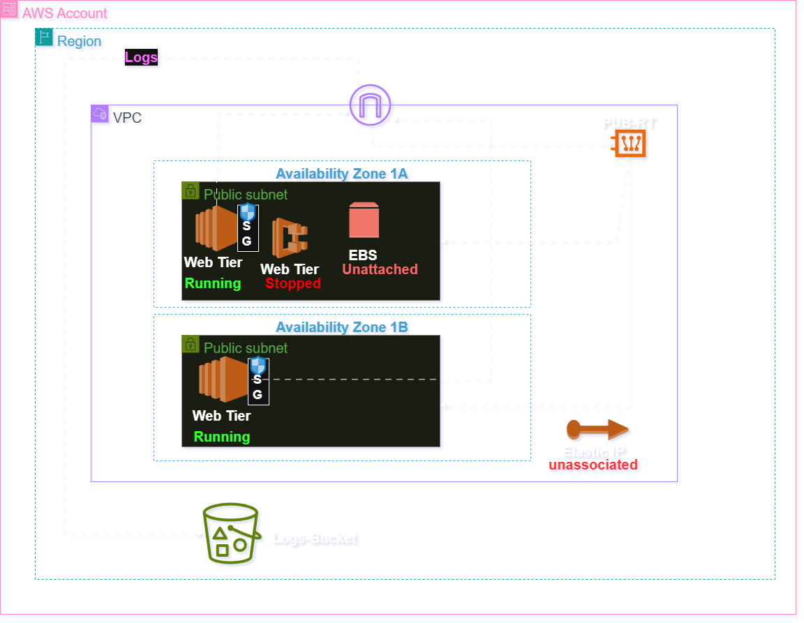

# DevOps Assignment — Vaibhav Chaudhari

A beginner-friendly DevOps project demonstrating Infrastructure as Code, bash automation, and CI/CD pipelines using Terraform, LocalStack, and GitHub Actions.

---

## Overview

This project is divided into three parts:

- **Part A — Terraform Infrastructure:** Provisions AWS-like resources on LocalStack using Terraform modules. Resources include VPCs, EC2 instances, EBS volumes, security groups, tagging policies, and an S3 bucket with versioning and lifecycle rules.

- **Part B — Cost Janitor Script:** A Bash automation script that scans the environment for orphaned or wasteful resources — unattached EBS volumes, stopped EC2 instances, unused Elastic IPs, and resources missing required tags. A complete GitHub Actions CI/CD workflow automatically starts LocalStack, applies Terraform, runs the Cost Janitor in dry-run mode, uploads reports as workflow artifacts, and comments findings on Pull Requests.

- **Part C — Design Note:** Covers security considerations, high availability, multi-cloud architecture possibilities, future improvements, and areas where human intervention may still be required.

---

## Prerequisites

Make sure the following tools are installed before running the project locally:

- [Docker](https://www.docker.com/)
- [Terraform](https://developer.hashicorp.com/terraform/install)
- [AWS CLI](https://aws.amazon.com/cli/)
- `awscli-local` — LocalStack wrapper for AWS CLI
- A [LocalStack](https://localstack.cloud/) account with an Auth Token

---

## How to Run Locally

### 1. Clone the Repository

```bash
git clone https://github.com/VaibhavJC/DevOps_Assignment-Vaibhav_Chaudhari.git
cd DevOps_Assignment-Vaibhav_Chaudhari
```

### 2. Install the AWS CLI LocalStack Wrapper

```bash
pip install awscli-local
```

### 3. Start LocalStack

Recent versions of LocalStack require an authentication token. Replace `your_token_here` with your LocalStack Auth Token.

**PowerShell:**
```powershell
docker run --rm -it `
  -p 4566:4566 `
  -p 4510-4559:4510-4559 `
  -e LOCALSTACK_AUTH_TOKEN="your_token_here" `
  -v /var/run/docker.sock:/var/run/docker.sock `
  localstack/localstack-pro
```

> **Note for GitHub Actions:** Store your LocalStack Auth Token as a GitHub Secret to use it in CI/CD workflows.
> Go to: **Settings → Secrets and Variables → Actions → New Repository Secret**
> Create a secret named `LOCALSTACK_AUTH_TOKEN` and paste your token value.

### 4. Configure AWS CLI

```powershell
$env:HOME="C:\Users\Administrator"
aws configure
```

Use the following dummy credentials (required by LocalStack):

| Field | Value |
|---|---|
| AWS Access Key ID | `test` |
| AWS Secret Access Key | `test` |
| Default Region | `us-east-1` |
| Default Output Format | `json` |

### 5. Register a Dummy AMI

LocalStack does not provide default AMIs, so you need to register one manually before running Terraform.

```bash
aws ec2 register-image \
  --name test-ami \
  --description "Test AMI for LocalStack" \
  --root-device-name /dev/sda1 \
  --block-device-mappings 'DeviceName=/dev/sda1,Ebs={VolumeSize=8}' \
  --virtualization-type hvm \
  --architecture x86_64 \
  --endpoint-url=http://localhost:4566
```

Copy the `ami-id` from the output and paste it into `environment/test/terraform.tfvars`.

### 6. Run Terraform

```bash
terraform init
terraform fmt
terraform validate
terraform plan -var-file="environment/test/terraform.tfvars"
terraform apply -var-file="environment/test/terraform.tfvars" -auto-approve
```

---

## Architecture

The diagram below shows the infrastructure provisioned by Terraform on LocalStack.



---

## Decisions & Deviations

### A) Deviations from the Specification

- **Dynamic AMI registration:** LocalStack has no default AMI, so a dummy AMI is registered before running Terraform.
- **Networking additions:** An Internet Gateway, public route table, and subnet association were created. Without these, subnets remain private and isolated — which would prevent the project from functioning as expected.
- **Variable-driven configuration:** All values are passed via `terraform.tfvars` to make the IaC code reusable and easy to adjust for different environments.
- **IAM policy for S3 logging:** An IAM policy was created and attached to the EC2 instance to allow it to store logs in the S3 bucket.

### B) Followed the Spec but Think It Is Wrong

- **Open CIDR (0.0.0.0/0):** Allowing traffic from all external sources was required by the specification, but this is insecure for real-world environments.
- **Web-tier instance in public subnet:** The specification placed the web/application instance in a public subnet, which is not a recommended practice for production deployments.

### C) Assumptions Made Due to Unclear Specification

- Resources were deployed in a public subnet because the spec did not clearly specify subnet placement.
- The S3 bucket was created with default configuration since the spec did not mention whether public access should be blocked.
- `us-east-1` was assumed as the region since no region strategy was defined in the spec.

---

## Trade-offs & Future Improvements


Given more time, the architecture would be improved to be closer to a production-ready AWS deployment:

- **Private subnets across two Availability Zones** for higher availability, with only the load balancer and bastion host in public subnets.
- **Auto Scaling Group (ASG)** to automatically scale EC2 instances based on traffic, improving both scalability and cost efficiency. Lifecycle hooks would handle custom actions during instance launch or termination. Scheduling would keep instances running only during working hours, which is especially useful for staging and development environments.
- **NAT Gateway** to allow private instances to access the internet securely without being publicly exposed.
- **CloudWatch + S3** for application log storage, monitoring, and long-term retention.
- **Database servers in private subnets** for improved security.
- **Remote Terraform state** stored in S3 with DynamoDB state locking, instead of local state files. This prevents two users from running `terraform apply` at the same time on the same project.

---

## AI Usage Disclosure

During this assignment, I used both ChatGPT and Claude as learning and debugging assistants.

I mainly used **Claude** to plan the project structure and break the assignment into smaller, manageable tasks so I could stay organized and avoid missing requirements.

I used **ChatGPT** mostly for debugging, understanding LocalStack behaviour, structuring Markdown files, fixing grammatical mistakes, and creating helper scripts such as `janitor.sh` and the GitHub Actions workflow (`cost-janitor.yml`).

**One thing AI got wrong:** Initially, it suggested using a real AWS AMI ID directly inside LocalStack. LocalStack does not support real AWS AMIs by default, which caused Terraform to fail with an `InvalidAMIID.NotFound` error. After debugging and checking the LocalStack documentation, I manually registered a dummy AMI before running Terraform.

**What I wrote manually:** I intentionally wrote the Terraform networking structure and EC2 module configuration myself without relying heavily on AI-generated code. I wanted to properly understand Terraform modules, variable passing, outputs, and infrastructure organisation rather than just copying generated code. I also preferred referencing official Terraform documentation directly, since provider syntax and versions change frequently and AI-generated Terraform can introduce version compatibility issues.

While AI helped speed up debugging and scripting, I made sure to understand each command and script section before including it in the final solution.